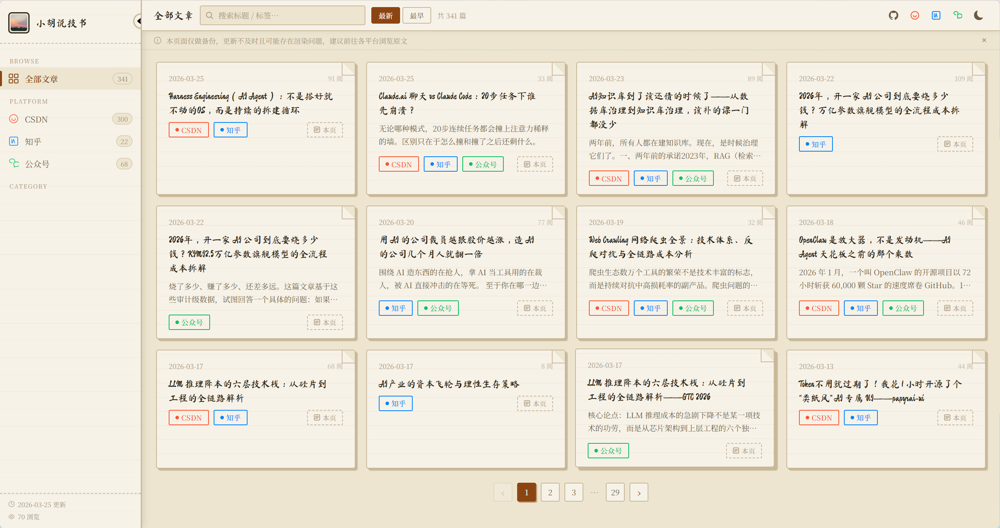

# 小胡说技书 · Blog Aggregator

> 聚合 CSDN、知乎、微信公众号的个人技术博客备份站  
> Personal tech blog aggregator — CSDN · Zhihu · WeChat Official Account



🔗 **在线访问 / Live site:** [小胡说技书](https://huyaochao.github.io/blog/)

---

## 简介 / About

本站是个人技术文章的**备份与聚合**页面，内容来自三个平台：

This site aggregates and backs up personal tech articles from three platforms:

| 平台 / Platform | 链接 / Link |
|---|---|
| CSDN | [h-y-c.blog.csdn.net](https://h-y-c.blog.csdn.net) |
| 知乎 / Zhihu | [zhihu.com/people/huyaochao](https://www.zhihu.com/people/huyaochao) |
| 微信公众号 / WeChat | 小胡说技书 |


> ⚠️ 本页面仅做备份，更新不及时且可能存在渲染问题，建议前往各平台浏览原文。  
> ⚠️ This site is a backup mirror. Content may lag behind or have rendering issues. Please visit the original platforms for the best experience.

---

## 功能 / Features

- 📚 三平台文章聚合，标题去重合并 / Three-platform aggregation with title-based deduplication
- 🌙 深色模式 / Dark mode toggle
- 🗂️ 分类导航 + 全文搜索 / Category nav + full-text search
- 📄 本地 Markdown 备份阅读 + 目录导航 / Local MD reader with TOC
- 📱 响应式布局 / Responsive layout
- 🔄 GitHub Actions 自动部署 / Auto-deploy via GitHub Actions

---

## 数据更新流程 / Update Workflow

```
1. 运行爬虫脚本获取各平台最新文章列表
   Run crawl scripts to fetch latest article lists

   CSDN:    在浏览器 Console 运行 scripts/crawl_csdn.js
   知乎:    在浏览器 Console 运行 scripts/crawl_zhihu.js
   微信:    在浏览器 Console 运行 scripts/crawl_wechat.js

2. 拉取 CSDN 文章正文（可选）
   Fetch CSDN article bodies (optional)

   python scripts/fetch_content.py --limit 0 --delay 2.5

3. 构建 posts.json + MD 备份
   Build posts.json and MD backups

   python scripts/build.py

4. 生成 Sitemap
   Generate sitemap

   python scripts/gen_sitemap.py

5. git push → GitHub Actions 自动部署
   git push → GitHub Actions auto-deploys
```

---

## 技术栈 / Tech Stack

- **纯静态** HTML + CSS + JavaScript，无构建框架 / Pure static, no build framework
- **数据层** `posts.json` 由 `build.py` 从各平台 JSON 合并生成
- **样式** 手写纸张质感 CSS（参考 [papyrai-ui](https://github.com/h-y-c/papyrai-ui)）
- **Markdown 渲染** [marked.js](https://marked.js.org/) CDN
- **部署** GitHub Pages + GitHub Actions

---

## 目录结构 / Project Structure

```
blog/
├── index.html          # 首页 / Home page
├── post.html           # 文章阅读页 / Article reader
├── posts.json          # 聚合数据 / Aggregated data
├── sitemap.xml         # SEO 站点地图 / Sitemap
├── css/                # 样式文件 / Stylesheets
├── posts/              # Markdown 备份 / MD backups
└── scripts/
    ├── build.py        # 数据构建 / Data builder
    ├── fetch_content.py# 正文抓取 / Content fetcher
    ├── gen_sitemap.py  # Sitemap 生成 / Sitemap generator
    ├── crawl_csdn.js   # CSDN 爬虫 / CSDN crawler
    ├── crawl_zhihu.js  # 知乎爬虫 / Zhihu crawler
    └── crawl_wechat.js # 微信爬虫 / WeChat crawler
```

---

## License

MIT
